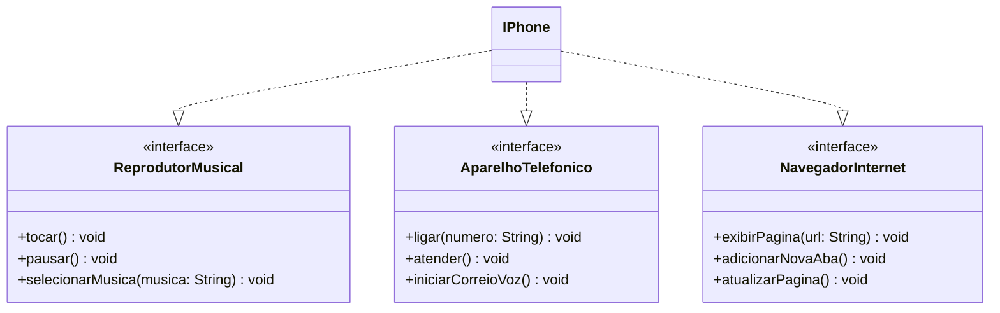

# Modelagem e Diagramação de um Componente iPhone

### Diagrama UML das funcionalidades requisitadas do iPhone
##### UML desenvolvido com Mermaid

### Contexto e Proposta do desafio (DIO - Trilha Java Básico - Programação Orienta a Objetos)

Com base no vídeo de lançamento do iPhone de 2007 (link abaixo), você deve elaborar a diagramação das classes e interfaces utilizando uma ferramenta UML de sua preferência. Em seguida, implemente as classes e interfaces no formato de arquivos .java.

[Lançamento iPhone 2007](https://www.youtube.com/watch?v=9ou608QQRq8)

Funcionalidades a Modelar:

Reprodutor Musical:
- Métodos: tocar(), pausar(), selecionarMusica(String musica)

Aparelho Telefônico:
- Métodos: ligar(String numero), atender(), iniciarCorreioVoz()

Navegador na Internet:
 - Métodos: exibirPagina(String url), adicionarNovaAba(), atualizarPagina()

Objetivos:
- Criar um diagrama UML que represente as funcionalidades descritas acima.
- Implementar as classes e interfaces correspondentes em Java (Opcional).

##### Os arquivos de projeto tratam-se de uma implementação-exemplo, bem simples, destas funcionalidades, focando no estudo de interfaces e programação orientada a objetos no geral.

##### Neste repositório há um print de como é visualmente, no GitHub mesmo, o diagrama acima apresentado acima, caso este não carregue. (Conferir diagrama.png)
