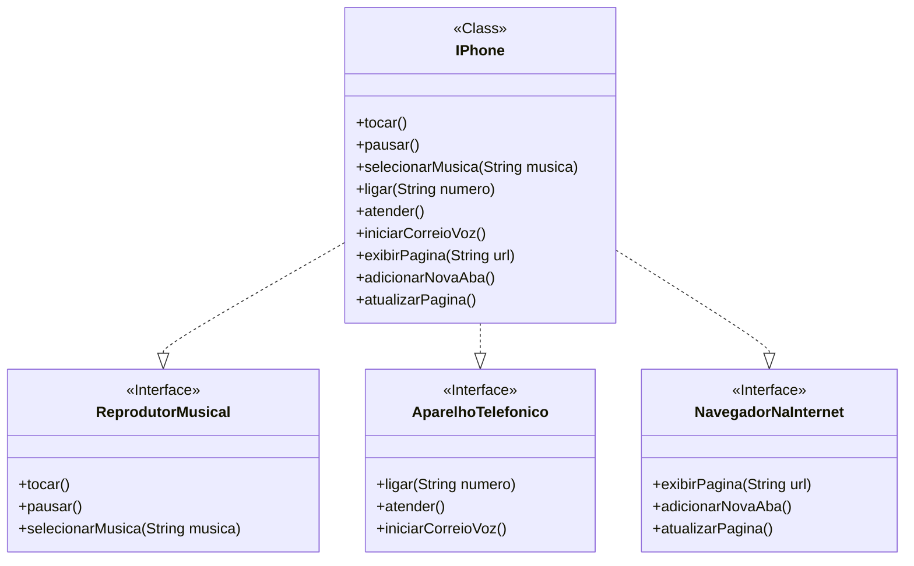

# Modelagem e Diagramação de um Componente iPhone

### Diagrama UML das funcionalidades requisitadas do iPhone
##### UML desenvolvido com Mermaid

##### Neste repositório há um print de como é visualmente, no GitHub mesmo, o diagrama acima. (Conferir diagrama.png)

##### Os arquivos de projeto tratam-se de uma implementação-exemplo, bem simples, destas funcionalidades, focando no estudo de interfaces e programação orientada a objetos no geral.